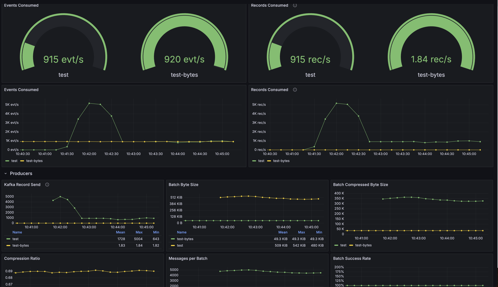

# Medium Articles Code Examples

This repository contains example code for Medium articles from [Zero-Hype](https://zero-hype.medium.com/).

## Medium Articles Code Modules

## Kafka Pre-Batching Module

This module demonstrates an efficient approach to Kafka message handling through application-level pre-batching. It provides an alternative to Kafka's native batching by implementing custom batching logic at the application level, offering more control over message compression and network efficiency.

Key features:
- Application-level message batching
- GZIP compression before Kafka transmission
- Customizable batch sizes and timing
- Comprehensive monitoring with Grafana dashboards

For detailed documentation and implementation details, see the [kafka-pre-batch README](kafka-pre-batch/README.md).
