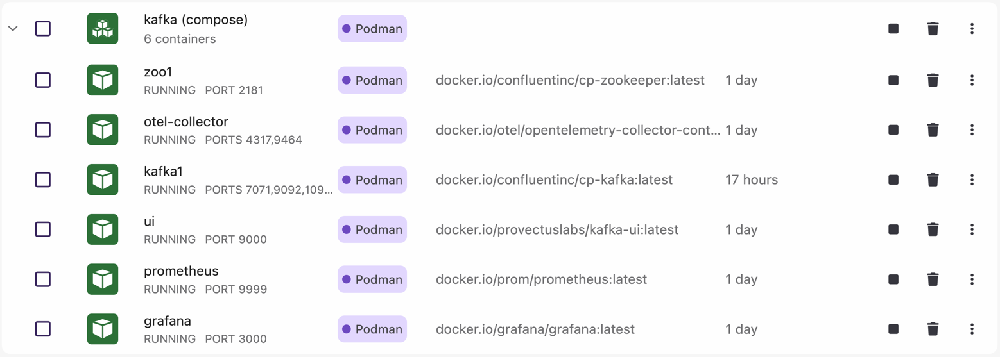
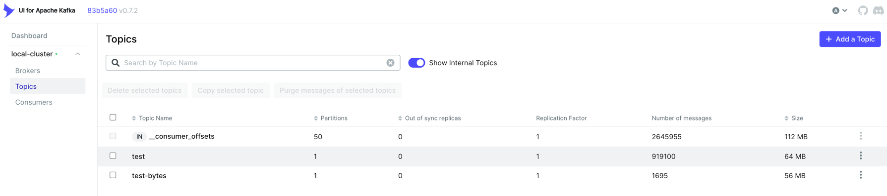

# Kafka Pre-Batching Example
Welcome to the Kafka Pre-Batching Example! Kafka is a powerful distributed streaming platform, and this project showcases an innovative way to 
optimize message handling by implementing application-level pre-batching. The POC approach is in no way a production-ready solution, 
but rather a demonstration of how to efficiently manage message throughput and network efficiency in Kafka applications. A launch pad for further
exploration and experimentation. From this starting point you can build more complex and robust solutions tailored to your specific use cases and
see how pre-batching can enhance your Kafka-based applications in realtime with updatable properties and dynamic batching strategies.

Project demonstrates an alternative approach to Kafka message batching by implementing application-level pre-batching before sending messages to Kafka. 
This example compares two different batching strategies:

1. **Application-Level Pre-Batching** (Custom Implementation)
   - Messages are collected and batched at the application level
   - Batches are compressed using GZIP before sending to Kafka
   - Provides more control over batching logic and compression
   - Reduces network overhead by sending fewer, larger messages

2. **Native Kafka Batching** (Standard Approach)
   - Uses Kafka's built-in batching mechanism
   - Relies on Kafka's native compression
   - Simpler implementation but less control over batching

## Why Pre-Batching?

Kafka's native batching is powerful, but there are scenarios where application-level pre-batching can be beneficial:

1. **Network Efficiency**
   - Reduces the number of network calls to Kafka
   - Compresses multiple messages together for better compression ratios
   - Minimizes network overhead for high-throughput applications

2. **Custom Batching Logic**
   - Implement custom batching strategies based on your needs
   - Control batch sizes and timing more precisely
   - Add application-specific optimizations

3. **Compression Control**
   - Apply compression before sending to Kafka
   - Choose compression algorithms based on your data characteristics
   - Optimize for your specific use case

## How It Works

### 1. Message Collection
```java
KafkaPreBatcher batcher = new KafkaPreBatcher(manager, 1000, producer);
batcher.add("message").thenAccept(success -> {
    if (success) {
        // Message added to batch successfully
    }
});
```
- Messages are collected in a thread-safe queue
- Configurable batch size (default: 1000 messages)
- Asynchronous processing using CompletableFuture

### 2. Batch Processing
```java
// When batch size is reached:
List<String> batch = new ArrayList<>(batchSize);
queue.drainTo(batch, batchSize);
shipIt(batch);
```
- Messages are accumulated until batch size is reached
- Batches are processed asynchronously
- Thread-safe batch handling

### 3. Compression and Sending
```java
byte[] bytes = serialize(batch);  // Compresses the batch
kafkaProducer.publish(bytes);     // Sends to Kafka
```
- Batches are compressed using GZIP
- Compressed batches are sent as single Kafka messages
- Metrics are collected for monitoring

## Getting Started

1. **Prerequisites**
   - Java 24
   - Docker and Docker Compose
   - Maven

2. **Start the Infrastructure**
   ```bash
   cd docker/kafka
   docker-compose up -d
   ```

3. **Build the Project**
   ```bash
   mvn clean package
   ```

4. **Import Dashboard**
   Open Grafana at [http://localhost:3000](http://localhost:3000) username:admin and password: admin, import the dashboard from `kafka-pre-batch/assets/dashboards/kafka-pre-batch.json`.

### Run the Applications

You can run the applications in three separate terminals:

**Terminal 1: Start the consumer**
```bash
cd kafka-pre-batch
mvn exec:java -Dexec.mainClass="com.zero.hype.kafka.app.KafkaConsumerApp"
```

**Terminal 2: Run the pre-batching producer**
```bash
cd kafka-pre-batch
mvn exec:java -Dexec.mainClass="com.zero.hype.kafka.app.ByteArrayKafkaProducerApp"
```

**Terminal 3: Run the native batching producer (for comparison)**
```bash
cd kafka-pre-batch
mvn exec:java -Dexec.mainClass="com.zero.hype.kafka.app.NativeKafkaProducerApp"
```

Alternatively, you can run the JAR directly:
```bash
# Terminal 1: Start the consumer
java -cp target/kafka-pre-batch-1.0-SNAPSHOT.jar com.zero.hype.kafka.app.KafkaConsumerApp

# Terminal 2: Run the pre-batching producer
java -cp target/kafka-pre-batch-1.0-SNAPSHOT.jar com.zero.hype.kafka.app.ByteArrayKafkaProducerApp

# Terminal 3: Run the native batching producer (for comparison)
java -cp target/kafka-pre-batch-1.0-SNAPSHOT.jar com.zero.hype.kafka.app.NativeKafkaProducerApp
```

## Monitoring


The application includes a complete monitoring stack:
- OpenTelemetry for metrics collection
- Prometheus for metrics storage
- Grafana for visualization

Key metrics available:
- Message throughput
- Batch sizes
- Compression ratios
- Processing latency
- Error rates

Access the monitoring tools:
- Grafana: http://localhost:3000 (admin/admin) 
- Prometheus: http://localhost:9999
- Kafka UI: http://localhost:9000 


## Performance Considerations

### Pre-batching Advantages
- Reduced network calls to Kafka
- Better compression ratios
- More control over batching logic
- Custom optimization possibilities

### Pre-batching Trade-offs
- Additional application complexity
- Memory usage for message buffering
- Potential latency for small batches
- Need to handle batch failures

## When to Use Pre-batching

Consider pre-batching when:
1. Your application has high message throughput
2. Network efficiency is critical
3. You need custom batching logic
4. You want more control over compression
5. Your messages are small and benefit from batching

## Configuration

### Pre-batcher Configuration
```java
Map.of(
    KafkaConstants.CONFIG_TOPIC, "test-bytes",
    KafkaConstants.CONFIG_BOOTSTRAP_SERVERS, "localhost:9092",
    KafkaConstants.CONFIG_ACKS, "1",
    KafkaConstants.CONFIG_COMPRESSION_TYPE, "none",  // We handle compression
    KafkaConstants.CONFIG_LINGER_MS, "0"            // No additional batching
)
```

### Batch Size Considerations
- Default: 1000 messages
- Queue capacity: 100x batch size
- Adjust based on:
  - Message size
  - Memory constraints
  - Latency requirements
  - Throughput needs

### Dynamic Property Updates (zero.properties)

The application utilizes a `zero.properties` file for managing certain operational parameters, such as thread counts, messages per iteration, sleep times, and batch sizes. These properties are dynamically reloaded every 10 seconds, allowing for runtime adjustments to message rates and algorithm behavior.

**Example `zero.properties`:**
```properties
# Byte Array App (Pre-batching) Settings
byte.app.thread.count=1
byte.app.message.per.iteration=100
byte.app.sleep.time=10
byte.app.batch.size=100

# Native Kafka App Settings
native.app.thread.count=1
native.app.message.per.iteration=100
native.app.sleep.time=10
```

**Important Considerations:**
-   **Running from IDE:** When you run the application directly (e.g., its `main` method from your IDE), changes to the `src/main/resources/zero.properties` file will be picked up dynamically at runtime after a short delay (up to 10 seconds). This is because the application will load it as a classpath resource if no external path is specified.
-   **Running from JAR:** When the application is packaged into a JAR file, you have two options for `zero.properties`:
    1.  **Bundled (Default):** If no external path is specified, the `zero.properties` file bundled within the JAR at build time will be used. Changes to this bundled file *after* the JAR is built will **not** be reflected at runtime due to classloader caching.
    2.  **Externalized (Recommended for JARs):** To allow dynamic updates or configuration changes without rebuilding the JAR, you can place the `zero.properties` file outside your JAR and specify its location using the system property `zero.properties.path` when running the application. For example:
        ```bash
        java -Dzero.properties.path=/path/to/your/zero.properties -jar target/kafka-pre-batch-1.0-SNAPSHOT.jar
        ```
        In this mode, the application will periodically re-load the properties from the specified external file. If the external file is not found at startup or during a reload attempt, the application will log a warning and attempt to use/retain the last known valid properties (or fall back to classpath if it's the first load attempt and external fails).

## Contributing

Feel free to submit issues and enhancement requests!
